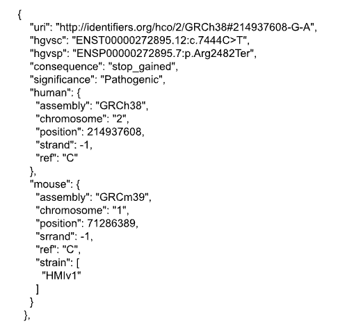

# Background

Experimental mice are widely used in human disease studies. Since the inception of mouse genetic research, hundreds of diverse strains have been established for biomedical research. In disease model mouse strains, information on genomic variations is essential for elucidating the relationship between haplotypes and disease susceptibility. To select a disease model mouse appropriately, it is crucial to identify mouse variants with the same effect as disease-causing variants in humans. Homologous human and mouse genes have been identified and shared in integrated human and model organism databases [1] [2]. At the genetic variant level, however, the explicit relationships between human variants and their mouse counterparts have yet to be included in these databases. A previous study successfully mapped human pathogenic variants mostly found in conserved coding regions to orthologous positions in the cow and pig genomes [3]. In BH2023, we aimed to map human pathogenic variants to orthologous positions in the mouse genome based on the sequence similarity between the two species. 

# Outcomes

Using the reference sequences of humans and mice, we compared the regions encoding proteins of homologous genes. First, we focused on nucleotide variants involved in amino acid substitutions. We have developed an API that returns mouse variants and strains in MoG+ as counterparts to ClinVar variants within the gene region specified by an HGNC gene symbol. The API URL is https://sparql-support.dbcls.jp/rest/human_variant_to_mouse, where queries to TogoVar,  TogoDX,  Ensembl, MoG+, and UCSC are called in a SPARQList. 

Figure 1: Example of an API response for the human ABCA12 gene

To reproduce Figure 1, please visit the following link:
https://sparql-support.dbcls.jp/rest/api/human_variant_to_mouse?hgnc=ABCA12&clinvar=true&strain_match=true.

# Future work

We will evaluate the mapping accuracy by comparing annotations of human variants with those of their corresponding mouse variants. The annotations include substitution patterns of amino acids and molecular functions. The mapping results will be presented as the links between a comprehensive human variation database TogoVar [4] and a model mouse genome database MoG+ [5].
In the future, we will not only focus on comparisons based solely on the homology of nucleotide sequences encoding proteins in humans and mice, but also take into consideration the functionality of cis-elements involved in gene expression regulation, considering repetitive elements. Additionally, we will prioritize genomic variants of disease-causing genes based on literature information and the results of large-scale gene knockout projects in mice. The goal is to develop an information infrastructure for accurately selecting the most suitable mouse model strains for human disease research.

## Acknowledgements

We would like to thank the fellow participants at BioHackathon 2023 for their collaboration and constructive advice, which greatly influenced our project. We are grateful to the organizers for providing this platform. Special thanks to the MoG+ and TogoVar development team members for their guidance and support. Without their contributions, our project would not have been possible.

## References

1. Wang J, Al-Ouran R, Hu Y, et al. MARRVEL: Integration of Human and Model Organism Genetic Resources to Facilitate Functional Annotation of the Human Genome. Am J Hum Genet. 2017;100(6):843-853. doi:10.1016/j.ajhg.2017.04.010
2. HomoloGene. https://www.ncbi.nlm.nih.gov/homologene 
3. Zhao R, Talenti A, Fang L, et al. The conservation of human functional variants and their effects across livestock species. Commun Biol. 2022;5(1):1003. Published 2022 Sep 21. doi:10.1038/s42003-022-03961-1
4. Mitsuhashi N, Toyo-Oka L, Katayama T, et al. TogoVar: A comprehensive Japanese genetic variation database. Hum Genome Var. 2022;9(1):44. Published 2022 Dec 12. doi:10.1038/s41439-022-00222-9
5. Takada T, Fukuta K, Usuda D, et al. MoG+: a database of genomic variations across three mouse subspecies for biomedical research. Mamm Genome. 2022;33(1):31-43. doi:10.1007/s00335-021-09933-w

